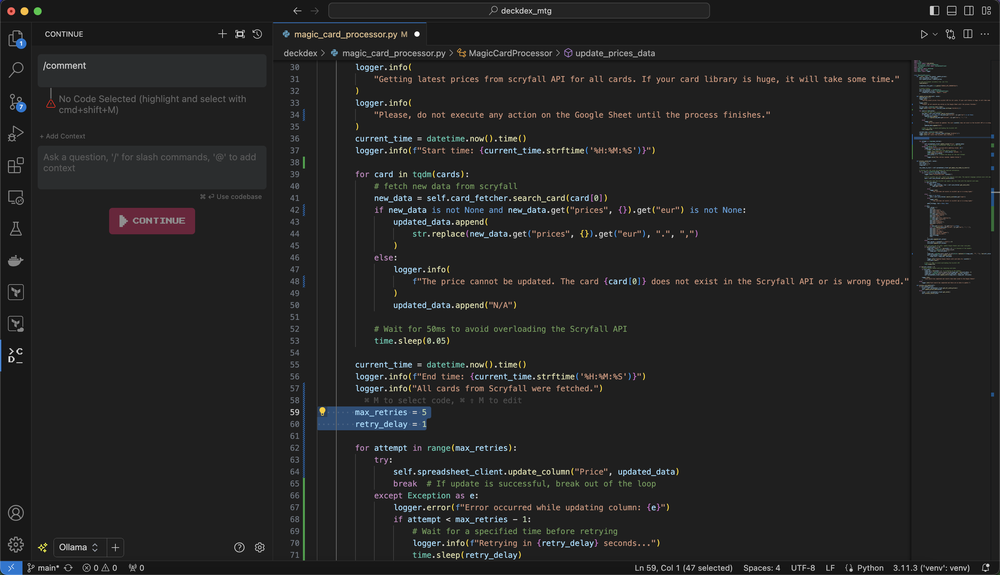
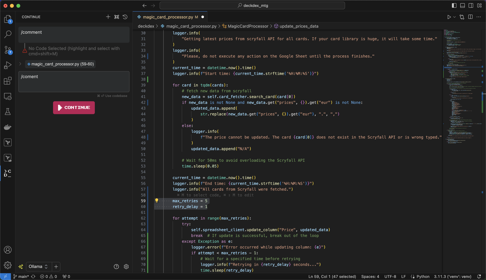
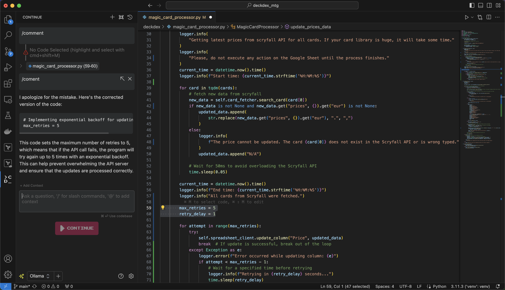

# ollama_vscode
To use Ollama within VsCode, you need first:
1. Install ollama in your laptop. Go to https://ollama.ai/download and install it.
2. Pull this Model:
```ollama pull codellama:7b```
3. In VsCode, go to Extensions and install the "continue" extension.
4. Copy the config.json in you $HOME/.continue folder
5. Restart VsCode if you had it opened.
6. In VsCode you will see a new section "Continue" in the left bar. 

# Simple example: code comments
1. Select the code to be commented:



2. Write comment and press enter in the "continue" text box:



3. You'll see the next comment:


